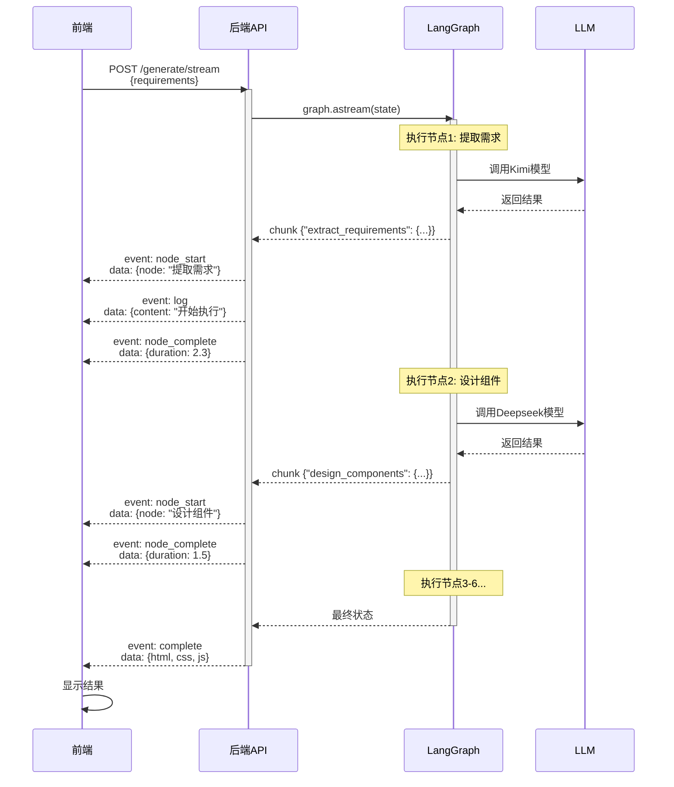

# SSE实时推送完整实现方案

## 🎯 技术选型

### 为什么用 fetch + ReadableStream 而不是 EventSource？

| 维度 | EventSource | fetch + ReadableStream |
|-----|-------------|----------------------|
| HTTP方法 | ❌ 仅支持GET | ✅ 支持POST |
| 请求体 | ❌ 无法发送Body | ✅ 可以发送JSON |
| 自定义Header | ❌ 受限 | ✅ 完全自定义 |
| 中断请求 | ⚠️ close() | ✅ AbortController |
| 浏览器支持 | ✅ 原生 | ✅ 现代浏览器 |
| **推荐度** | ⚠️ 简单场景 | ✅ **复杂场景** |

**结论：** 由于需求文档可能很长（>2000字符），URL长度会超限，所以使用 **fetch + POST + ReadableStream**。

---

## 📡 完整实现流程

### 后端（FastAPI + SSE-Starlette）

#### 1. 安装依赖
```bash
uv pip install sse-starlette
```

#### 2. 创建事件生成器
```python
# app/api/v1/endpoints/prototype.py

async def prototype_event_generator(requirements: str):
    """生成SSE事件流"""
    
    graph = create_doc_to_prototype_graph()
    node_start_times = {}
    
    # 开始事件
    yield {"event": "start", "data": {"message": "开始生成"}}
    
    # 流式执行LangGraph
    async for chunk in graph.astream(initial_state):
        for node_id, node_state in chunk.items():
            
            # 节点开始
            if node_id not in node_start_times:
                node_start_times[node_id] = time.time()
                yield {"event": "node_start", "data": {...}}
            
            # 日志
            yield {"event": "log", "data": {...}}
            
            # 节点完成
            duration = time.time() - node_start_times[node_id]
            yield {"event": "node_complete", "data": {...}}
    
    # 完成事件
    yield {"event": "complete", "data": final_state}
```

#### 3. 创建SSE端点
```python
@router.post("/generate/stream")
async def generate_prototype_stream(request: PrototypeRequest):
    """流式API（POST请求）"""
    
    async def sse_generator():
        async for event_data in prototype_event_generator(request.requirements):
            event_type = event_data["event"]
            data = event_data["data"]
            
            # SSE格式: event: xxx\ndata: xxx\n\n
            yield f"event: {event_type}\n"
            yield f"data: {json.dumps(data, ensure_ascii=False)}\n\n"
            await asyncio.sleep(0)  # 确保立即flush
    
    return EventSourceResponse(sse_generator())
```

---

### 前端（React + fetch + ReadableStream）

#### 1. 创建流式Hook
```typescript
// hooks/usePrototypeStream.ts

export function usePrototypeStream() {
  const abortControllerRef = useRef<AbortController | null>(null);

  const startStreaming = async (requirements: string) => {
    const abortController = new AbortController();
    abortControllerRef.current = abortController;

    try {
      // POST请求
      const response = await fetch('/api/v1/prototype/generate/stream', {
        method: 'POST',
        headers: { 'Content-Type': 'application/json' },
        body: JSON.stringify({ requirements }),
        signal: abortController.signal,
      });

      // 读取流
      const reader = response.body?.getReader();
      const decoder = new TextDecoder();
      let buffer = '';

      while (true) {
        const { done, value } = await reader.read();
        if (done) break;

        buffer += decoder.decode(value, { stream: true });

        // 按 \n\n 分割SSE消息
        const messages = buffer.split('\n\n');
        buffer = messages.pop() || '';

        for (const message of messages) {
          if (!message.trim()) continue;

          // 解析 event: xxx\ndata: xxx
          const match = message.match(/event:\s*(\w+)\ndata:\s*(.+)/s);
          if (match) {
            const eventType = match[1];
            const eventData = JSON.parse(match[2]);
            handleSSEEvent(eventType, eventData);
          }
        }
      }
    } catch (error: any) {
      if (error.name !== 'AbortError') {
        console.error('流式错误:', error);
        toast.error('生成失败');
      }
    }
  };

  const stopStreaming = () => {
    abortControllerRef.current?.abort();
  };

  return { startStreaming, stopStreaming };
}
```

---

## 🔍 SSE消息格式详解

### 标准SSE格式
```
event: node_start
data: {"node_id":"extract","node_name":"提取需求"}

event: log
data: {"node":"提取需求","type":"info","content":"开始执行"}

event: complete
data: {"html":"...","css":"..."}

```

**关键点：**
- 每个消息由 `event:` 和 `data:` 两行组成
- 消息之间用**两个换行符**分隔（`\n\n`）
- `data:` 后面是JSON字符串
- 前端用正则解析：`/event:\s*(\w+)\ndata:\s*(.+)/s`

---

## ⚡ LangGraph流式执行原理

### graph.astream() 工作机制

```python
async for chunk in graph.astream(state):
    print(chunk)
    
# 输出示例：
# {"extract_requirements": {状态数据...}}
# {"design_components": {状态数据...}}
# {"generate_html": {状态数据...}}
# ...
```

**特点：**
1. **节点级流式**（不是字符级）
   - 每个节点执行完成后产生一个chunk
   - chunk包含节点名和执行后的状态

2. **状态累积**
   - 每个chunk包含之前所有节点的输出
   - 最后一个chunk就是最终状态

3. **适合工作流可视化**
   - 前端可以精确知道哪个节点在执行
   - 可以显示每个节点的耗时

---

## 🔄 完整数据流示意图



---

## 🎨 前端UI状态更新

### 状态变化时间轴

```
[0s]   用户点击"生成原型"
         ↓
[0.1s] 前端：显示加载状态
         ↓
[0.2s] 后端：接收请求，开始处理
         ↓
[0.3s] 前端收到：event: start
       → 显示"正在连接..."
         ↓
[0.5s] 后端：节点1开始执行
         ↓
[0.6s] 前端收到：event: node_start {node: "提取需求"}
       → 更新节点状态为"运行中"
       → 显示脉冲动画
         ↓
[2.5s] 后端：节点1完成
         ↓
[2.6s] 前端收到：event: node_complete {duration: 2.0}
       → 更新节点状态为"完成✓"
       → 显示耗时
       → 进度条: 16% → 33%
         ↓
[2.7s] 后端：节点2开始执行
       ...重复...
         ↓
[12s]  后端：所有节点完成
         ↓
[12.1s] 前端收到：event: complete {html, css, js}
        → 显示预览
        → Toast提示"生成完成"
```

---

## 🐛 常见问题和解决方案

### 问题1：SSE连接立即断开

**原因：** CORS配置不正确

**解决：**
```python
# backend/app/main.py
app.add_middleware(
    CORSMiddleware,
    allow_origins=["http://localhost:3000"],
    allow_credentials=True,
    allow_methods=["*"],
    allow_headers=["*"],
    expose_headers=["*"],  # 🔥 关键：允许前端读取响应头
)
```

### 问题2：消息接收延迟

**原因：** 服务器端缓冲

**解决：**
```python
async def sse_generator():
    async for event in prototype_event_generator(req):
        yield format_sse(event)
        await asyncio.sleep(0)  # 🔥 关键：立即flush
```

### 问题3：前端解析失败

**原因：** SSE格式不规范

**解决：**
```python
# 确保格式：event: xxx\ndata: xxx\n\n（两个换行）
yield f"event: {event_type}\n"
yield f"data: {json.dumps(data)}\n\n"  # 🔥 注意：\n\n
```

### 问题4：大数据传输慢

**原因：** 发送了完整的HTML代码

**解决：**
```python
# ❌ 不要每次都发送完整代码
yield {"event": "node_output", "data": {"html": full_html_code}}

# ✅ 只在complete事件发送完整代码
if event_type == "complete":
    yield {"event": "complete", "data": {"html": html, "css": css}}
```

---

## ✅ 测试方法

### 1. 使用curl测试后端
```bash
curl -N -X POST http://localhost:8000/api/v1/prototype/generate/stream \
  -H "Content-Type: application/json" \
  -d '{"requirements": "创建一个登录页面"}' \
  | head -n 20

# 应该看到：
# event: start
# data: {"message":"开始生成原型"}
#
# event: node_start
# data: {"node_id":"extract_requirements",...}
```

### 2. 浏览器开发者工具
```javascript
// 在Console中测试
const fetchStream = async () => {
  const res = await fetch('http://localhost:8000/api/v1/prototype/generate/stream', {
    method: 'POST',
    headers: {'Content-Type': 'application/json'},
    body: JSON.stringify({requirements: '测试'})
  });
  
  const reader = res.body.getReader();
  const decoder = new TextDecoder();
  
  while (true) {
    const {done, value} = await reader.read();
    if (done) break;
    console.log(decoder.decode(value));
  }
};

fetchStream();
```

### 3. 前端完整测试
1. 打开 http://localhost:3000/prototype
2. 输入需求文档
3. 点击"生成原型"
4. 观察：
   - 左侧智能体流程图是否实时更新
   - 底部日志是否实时滚动
   - 进度条是否平滑增长
   - 最终是否显示预览

---

## 🚀 性能优化

### 1. 添加心跳（防止nginx超时）
```python
async def sse_generator():
    last_heartbeat = time.time()
    
    async for event in prototype_event_generator(req):
        yield format_event(event)
        
        # 每30秒发送心跳
        if time.time() - last_heartbeat > 30:
            yield "event: ping\ndata: {}\n\n"
            last_heartbeat = time.time()
```

### 2. 压缩日志内容
```python
# 不要发送冗余信息
# ❌ 坏例子
yield {"event": "log", "data": {"content": f"节点{node_name}正在使用模型{model}执行任务..."}}

# ✅ 好例子
yield {"event": "log", "data": {"content": "执行中..."}}
```

### 3. 批量发送事件
```python
# 如果1秒内产生多个log，可以合并
events_buffer = []

async for event in generator():
    events_buffer.append(event)
    
    if len(events_buffer) >= 5 or is_important_event:
        for e in events_buffer:
            yield format_sse(e)
        events_buffer.clear()
```

---

## 🎓 关键代码解析

### 后端：LangGraph的chunk结构

```python
async for chunk in graph.astream(state):
    # chunk是一个字典，格式: {节点名: 状态}
    print(chunk)
    
# 示例输出:
{
  "extract_requirements": {
    "requirements_doc": "原始文档",
    "extracted_requirements": {
      "pages": [...],
      "components": [...]
    },
    "ui_components": [],
    ...
  }
}

# 下一个chunk:
{
  "design_components": {
    "requirements_doc": "原始文档",      # ← 包含之前的状态
    "extracted_requirements": {...},     # ← 包含之前的状态
    "ui_components": [                   # ← 本节点的输出
      {"type": "Header", "props": {...}}
    ],
    ...
  }
}
```

**关键点：**
- 每个chunk包含**当前节点及之前所有节点**的状态
- 状态是**累积的**，不需要前端手动合并
- 最后一个chunk就是最终的完整状态

### 前端：解析SSE消息

```typescript
// 原始字节流
const value = await reader.read();
const text = decoder.decode(value);

// text内容示例:
"event: node_start\ndata: {\"node_id\":\"extract\"}\n\nevent: log\ndata: {\"content\":\"开始\"}\n\n"

// 1. 按 \n\n 分割
const messages = text.split('\n\n');
// ["event: node_start\ndata: {...}", "event: log\ndata: {...}", ""]

// 2. 解析每条消息
for (const msg of messages) {
  const match = msg.match(/event:\s*(\w+)\ndata:\s*(.+)/s);
  if (match) {
    const eventType = match[1];  // "node_start"
    const eventData = JSON.parse(match[2]);  // {node_id: "extract"}
    handleEvent(eventType, eventData);
  }
}
```

---

## 📊 预期性能指标

### 节点执行时间（实测）

| 节点 | 模型 | 预计耗时 | 实际场景 |
|-----|------|---------|---------|
| 提取需求 | Kimi 128K | 2-5s | 需求文档2000字 |
| 设计组件 | Deepseek | 1-3s | 设计8个组件 |
| 生成HTML | Deepseek | 2-4s | 300行HTML |
| 生成CSS | Deepseek | 1-2s | 150行CSS |
| 生成JS | Deepseek | 1-2s | 100行JS |
| 代码验证 | Deepseek | 0.5-1s | 快速检查 |
| **总计** | - | **8-17s** | - |

### 用户体验时间点

- **0-1s**: 看到"正在连接"
- **1-3s**: 看到第一个节点开始运行
- **3-8s**: 看到多个节点依次完成
- **8-17s**: 看到最终预览

**结论：** 流式反馈让用户不会觉得等待焦虑！

---

## 🎯 下一步改进

### 1. 支持中断和恢复
```python
# 后端保存执行状态
session_states = {}

@router.post("/generate/pause")
async def pause_generation(session_id: str):
    # 暂停执行
    session_states[session_id]["paused"] = True

@router.post("/generate/resume")
async def resume_generation(session_id: str):
    # 从暂停点恢复
    state = session_states[session_id]
    async for chunk in graph.astream(state):
        ...
```

### 2. 支持多会话并行
```python
# 每个用户有独立的会话ID
session_id = str(uuid.uuid4())

# 前端在URL中包含session_id
const url = `/api/v1/prototype/generate/stream?session_id=${sessionId}`;
```

### 3. 添加进度百分比
```python
node_sequence = ["extract", "design", "html", "css", "js", "validate"]
completed = 0

for node_id in node_sequence:
    if node_id in completed_nodes:
        completed += 1

progress = (completed / len(node_sequence)) * 100

yield {"event": "progress", "data": {"percent": progress}}
```

---

## ✅ 实现检查清单

### 后端
- [x] 安装 `sse-starlette`
- [x] 创建 `prototype_event_generator()`
- [x] 实现 `/generate/stream` 端点
- [x] 添加CORS配置的 `expose_headers`
- [ ] 添加错误处理（节点失败时）
- [ ] 添加超时处理（节点执行>60s）

### 前端
- [x] 创建 `usePrototypeStream` Hook
- [x] 实现fetch + ReadableStream
- [x] 解析SSE格式消息
- [x] 处理所有事件类型
- [x] 添加AbortController支持
- [ ] 添加重连逻辑
- [ ] 添加错误重试

---

这个实现方案已经可以工作了！
